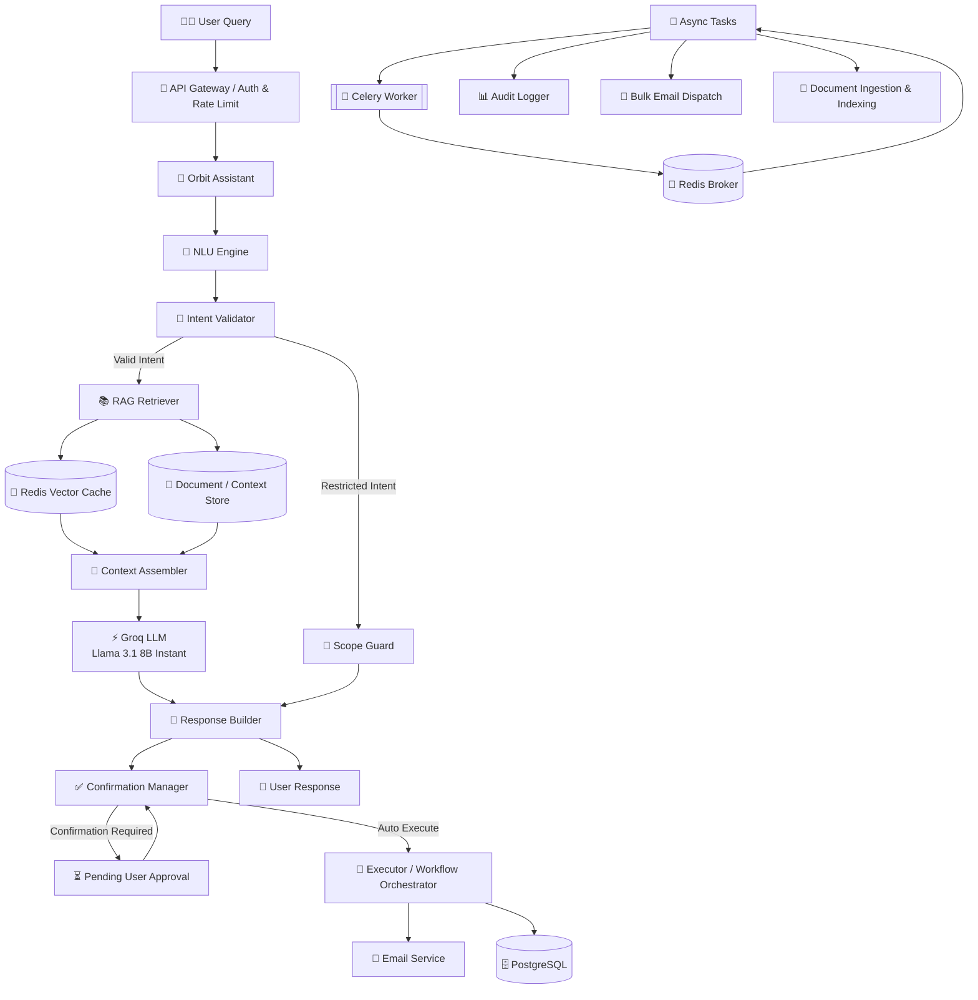
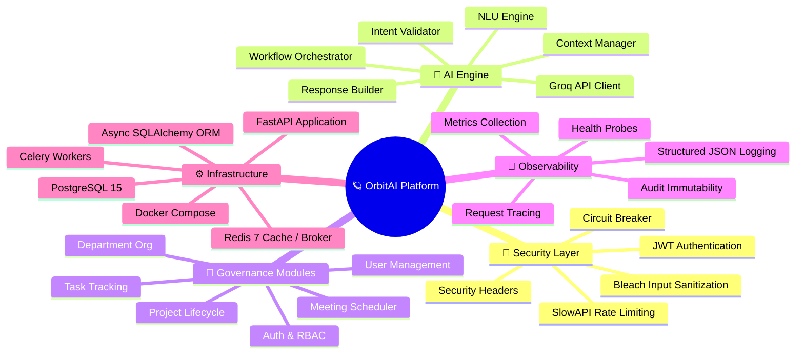

<p align="center">
  
</p>

<h1 align="center">🪐 OrbitAI Governance Platform</h1>

<p align="center">
  <strong>An enterprise-grade AI governance backend with RBAC, RAG-powered assistant & production resilience</strong>
</p>

<p align="center">
  
  
  
  
  
  
  
</p>

<p align="center">
  
  
  
  
</p>

---

## ✨ Features

<table>
<tr>
<td width="50%">

### 🏢 Enterprise Governance
- **Role-Based Access Control** (ADMIN / MANAGER / MEMBER)
- Department & reporting hierarchy management
- Project lifecycle & task assignment tracking
- Meeting scheduling with attendee invitations
- Row-level data isolation & audit immutability

</td>
<td width="50%">

### 🤖 AI Orbit Assistant
- **RAG Architecture** with context retrieval
- Intent recognition & workflow orchestration
- Confirmation gates for destructive actions
- NLU engine powered by **Llama 3.1 (Groq)**
- Scoped capability resolver with RBAC validation

</td>
</tr>
<tr>
<td width="50%">

### 🏗️ Clean Architecture
- **Controller → Service → Repository** layers
- **Base abstractions** for repositories & services
- Dependency Injection with FastAPI-native guards
- Middleware stack: CORS, security headers, rate limiting
- Pydantic v2 schemas for request/response validation

</td>
<td width="50%">

### 🛡️ Production Resilience
- **Circuit Breaker** for external service calls
- **Retry** with exponential backoff (Tenacity)
- **Timeout** protection & concurrency control
- **XSS Protection** via bleach input sanitization
- Structured JSON logging with request tracing

</td>
</tr>
</table>

---

## 🧠 RAG Architecture



---

## 🏛️ System Design Mindmap



---

##  Quick Start

### Option 1: Docker Compose (Recommended)

```bash
# Clone the repository
git clone <repo-url>
cd orbitai

# Copy environment file
cp .env.example .env

# Build and start all services
docker-compose up --build

# Access the application:
# API:       http://localhost:8000
# API Docs:  http://localhost:8000/docs
```

### Option 2: Local Development

```bash
# ── Start Database & Redis ──
docker-compose up -d postgres redis

# ── Backend ──
python -m venv venv
source venv/bin/activate  # Windows: venv\Scripts\activate
pip install -r requirements.txt
uvicorn app.main:app --reload --host 0.0.0.0 --port 8000
```

### Health Checks
- **Liveness**: `http://localhost:8000/health/live`
- **Readiness**: `http://localhost:8000/health/ready`

---

## 📡 API Documentation

### Interactive Docs
- **Swagger UI**: [http://localhost:8000/docs](http://localhost:8000/docs)
- **ReDoc**: [http://localhost:8000/redoc](http://localhost:8000/redoc)

### API Examples

#### Login
```bash
curl -X POST http://localhost:8000/api/v1/auth/login \
  -H "Content-Type: application/json" \
  -d '{"email": "nick.fury@shield.gov", "password": "password123"}'
```

#### Create Project (Admin / Manager)
```bash
curl -X POST http://localhost:8000/api/v1/projects \
  -H "Authorization: Bearer <token>" \
  -H "Content-Type: application/json" \
  -d '{
    "name": "Tesseract Research",
    "description": "Study of the infinite power stone",
    "department_id": 1,
    "manager_id": 2
  }'
```

#### Create Task
```bash
curl -X POST http://localhost:8000/api/v1/tasks \
  -H "Authorization: Bearer <token>" \
  -H "Content-Type: application/json" \
  -d '{
    "title": "Analyze energy signatures",
    "project_id": 1,
    "assigned_to": 3,
    "priority": "high"
  }'
```

#### Ask Orbit Assistant
```bash
curl -X POST http://localhost:8000/api/v1/assistant/chat \
  -H "Authorization: Bearer <token>" \
  -H "Content-Type: application/json" \
  -d '{
    "message": "Show me my pending tasks"
  }'
```

---

## 📁 Project Structure

```
orbitai/
├── app/
│   ├── core/
│   │   ├── database/
│   │   │   ├── __init__.py
│   │   │   └── database.py
│   │   ├── middleware/
│   │   │   ├── __init__.py
│   │   │   ├── concurrency.py
│   │   │   ├── cors_middleware.py
│   │   │   ├── error_handlers.py
│   │   │   ├── rate_limit.py
│   │   │   └── security_headers.py
│   │   ├── observability/
│   │   │   ├── __init__.py
│   │   │   └── structured_logger.py
│   │   ├── reliability/
│   │   │   ├── __init__.py
│   │   │   ├── circuit_breaker.py
│   │   │   ├── exception_normalizer.py
│   │   │   ├── retry.py
│   │   │   └── timeout.py
│   │   ├── resolvers/
│   │   │   ├── __init__.py
│   │   │   └── entity_resolver.py
│   │   ├── security/
│   │   │   ├── __init__.py
│   │   │   ├── input_sanitizer.py
│   │   │   └── security.py
│   │   ├── base_repository.py
│   │   ├── base_service.py
│   │   ├── config.py
│   │   ├── dependency.py
│   │   ├── dependency_validator.py
│   │   ├── error_handler.py
│   │   ├── execution_validator.py
│   │   ├── governance_policy.py
│   │   ├── response.py
│   │   ├── safety_middleware.py
│   │   ├── schema.py
│   │   └── security.py
│   ├── models/
│   │   └── __init__.py
│   ├── modules/
│   │   ├── auth/
│   │   │   ├── __init__.py
│   │   │   ├── auth_controller.py
│   │   │   ├── auth_model.py
│   │   │   ├── auth_repository.py
│   │   │   ├── auth_routers.py
│   │   │   ├── auth_schema.py
│   │   │   └── auth_services.py
│   │   ├── department/
│   │   │   ├── __init__.py
│   │   │   ├── department_controller.py
│   │   │   ├── department_model.py
│   │   │   ├── department_repository.py
│   │   │   ├── department_routers.py
│   │   │   ├── department_schema.py
│   │   │   └── department_services.py
│   │   ├── health/
│   │   │   ├── __init__.py
│   │   │   ├── health_controller.py
│   │   │   ├── health_repository.py
│   │   │   ├── health_routers.py
│   │   │   └── health_services.py
│   │   ├── meeting/
│   │   │   ├── __init__.py
│   │   │   ├── meeting_controller.py
│   │   │   ├── meeting_model.py
│   │   │   ├── meeting_repository.py
│   │   │   ├── meeting_routers.py
│   │   │   ├── meeting_schema.py
│   │   │   └── meeting_services.py
│   │   ├── orbit_assistant/
│   │   │   ├── __init__.py
│   │   │   ├── assistant_error_handler.py
│   │   │   ├── assistant_router.py
│   │   │   ├── assistant_service.py
│   │   │   ├── config.production.yaml
│   │   │   ├── config.yaml
│   │   │   ├── engine/
│   │   │   │   ├── __init__.py
│   │   │   │   ├── api_client.py
│   │   │   │   ├── assistant_logger.py
│   │   │   │   ├── audit_logger.py
│   │   │   │   ├── capability_audit.py
│   │   │   │   ├── capability_resolver.py
│   │   │   │   ├── capability_validator.py
│   │   │   │   ├── close_task_workflow.py
│   │   │   │   ├── confirmation_manager.py
│   │   │   │   ├── context_manager.py
│   │   │   │   ├── email_composer.py
│   │   │   │   ├── email_service.py
│   │   │   │   ├── entity_resolver.py
│   │   │   │   ├── entity_validator.py
│   │   │   │   ├── error_handler.py
│   │   │   │   ├── executor.py
│   │   │   │   ├── hire_candidate_workflow.py
│   │   │   │   ├── intent_normalizer.py
│   │   │   │   ├── intent_validator.py
│   │   │   │   ├── logger.py
│   │   │   │   ├── nlu_engine.py
│   │   │   │   ├── pending_confirmation_model.py
│   │   │   │   ├── pending_confirmation_repository.py
│   │   │   │   ├── rbac_validator.py
│   │   │   │   ├── response_builder.py
│   │   │   │   ├── scope_guard.py
│   │   │   │   ├── service_bridge.py
│   │   │   │   ├── start_project_workflow.py
│   │   │   │   └── workflow_orchestrator.py
│   │   │   ├── orbit_assistant_model.py
│   │   │   ├── pending_confirmation_model.py
│   │   │   ├── pending_confirmation_repository.py
│   │   │   ├── router.py
│   │   │   ├── routes/
│   │   │   │   ├── __init__.py
│   │   │   │   ├── capabilities.py
│   │   │   │   └── history.py
│   │   │   ├── schemas.py
│   │   │   └── system_intents.py
│   │   ├── project/
│   │   │   ├── __init__.py
│   │   │   ├── project_controller.py
│   │   │   ├── project_model.py
│   │   │   ├── project_repository.py
│   │   │   ├── project_routers.py
│   │   │   ├── project_schema.py
│   │   │   └── project_services.py
│   │   ├── role/
│   │   │   ├── __init__.py
│   │   │   ├── role_controller.py
│   │   │   ├── role_repository.py
│   │   │   ├── role_routers.py
│   │   │   ├── role_schema.py
│   │   │   └── role_services.py
│   │   ├── task/
│   │   │   ├── __init__.py
│   │   │   ├── task_controller.py
│   │   │   ├── task_model.py
│   │   │   ├── task_repository.py
│   │   │   ├── task_routers.py
│   │   │   ├── task_schema.py
│   │   │   └── task_services.py
│   │   └── user/
│   │       ├── __init__.py
│   │       ├── user_controller.py
│   │       ├── user_repository.py
│   │       ├── user_routers.py
│   │       ├── user_schema.py
│   │       └── user_services.py
│   ├── routers/
│   │   └── __init__.py
│   └── main.py
├── migrations/
│   ├── 001_add_manager_id_to_tasks.sql
│   ├── 002_add_manager_created_by_to_projects.sql
│   └── 003_fix_task_assignment_fk_cascade.sql
├── .env
├── alembic.ini
├── docker-compose.yml
├── Dockerfile
├── requirements.txt
└── README.md
```

---

## 🏗️ System Design Highlights

### Authorization Flow
```
Request → JWT Extraction → Token Validation → User Lookup
  → RBAC Permission Check → Scope Guard (Intent/Country) → Service Layer
```

### AI Intent State Machine
```
USER_INPUT → INTENT_RECOGNITION → VALIDATION → CONFIRMATION → EXECUTION → RESPONSE
                ↓                        ↓              ↓
          FALLBACK_QUERY           RESTRICTED   CANCELLED
```

### Caching & Queuing Strategy
```
Client → API → Redis (Cache-Aside + Rate Limiting) → PostgreSQL
              ↓
         Celery Workers (Email, Audit, Ingestion)
```

---

## 🛠️ Tech Stack

| Layer | Technology |
|-------|-----------|
| **Backend** | Python · FastAPI · Pydantic v2 |
| **Database** | PostgreSQL 15 · SQLAlchemy 2.0 (Async) · Alembic |
| **Cache / Queue** | Redis 7 · Celery |
| **AI Engine** | Groq API · Llama 3.1 8B Instant |
| **Auth** | JWT (python-jose) · bcrypt · Passlib |
| **Security** | Bleach · Slowapi · Tenacity · Custom Circuit Breaker |
| **Observability** | Structured JSON Logging · Health Probes · Metrics |
| **DevOps** | Docker · Docker Compose |

---

## 👨‍💻 Developed by

<div align="center">
  <!-- Place your profile image at assets/sudheer.png -->
  <a href="https://www.linkedin.com/in/sudheerkonduboina/">
    
  </a>
  <br/>
  <h3>Sudheer Konduboina</h3>
  <p>Software Engineer (Backend) & AIML Engineer</p>
  <a href="https://www.linkedin.com/in/sudheerkonduboina/">
    
  </a>
</div>

---

## © Copyright Notice

**© AI- Assistant. All Rights Reserved.**
